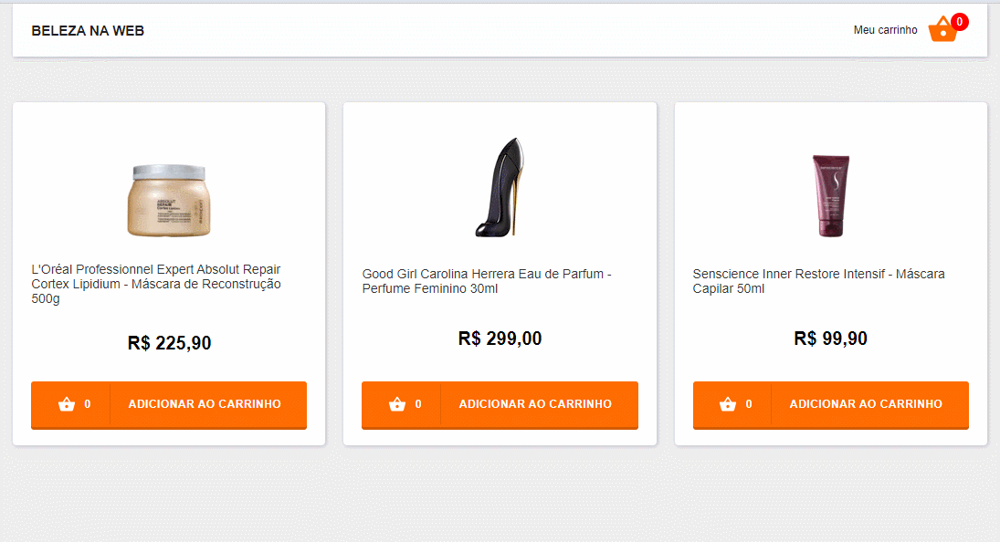

<h1 align=center> Beleza na Web</h1>

<p align=center> Aplicação de carrinho de e-commerce com consumo de API e steps de pagamento e sucesso

<h3 align=center>

💻 **Acesse a aplicação [aqui](https://dxwebster.github.io/test-front/)**

</h3>

<p align=center>

<h5 align=center>
<br>

</h5>

</p>


## 🛠 Tecnologias utilizadas

- react: `Framework Javascript baseado em componentes`

- typescript: `Linguagem de programação com tipagem estática`

- javascript: `Linguagem de programação com tipagem dinâmica`

- axios: `Cliente HTTP para fazer requisições à API`

- styled-components: `Estilização dos componentes com CSS-in-JS`

- react-router-dom: `Roteamento do sistema`

- unform: `Criação de formulários para React e React Native`

- yup: `Construtor de esquemas de validações de formulários`

- polished: `Biblioteca de Estilização js no css`

- react-spring: `Biblioteca de animação em js`

## 🛠 Ferramentas de desenvolvimento

- eslint: `Ferramenta de análise de erros em códigos`

- prettier: `Ferramenta de formatação de códigos`

- commitlint: `Ferramenta para verificar padrão de commits`

- husky: `Ferramenta para melhorar commits`


## ✨ Features implementadas

- Layout Responsivo
- Desenvolvimento Mobile First
- CI com Github Actions
- Persistência de dados em LocalStorage e contexto
- Toasts de success, error, warning
### Página de Produtos
- Listagem de produtos por consumo de API
- Loading de carregamento
- Botão de adicionar item no carrinho
- Contador de quantidade de produtos no carrinho
- Header com navegação para "Meu carrinho" e contador de itens
- Toast de success por adição de item no carrinho
- Toast de erro de adição de item fora de estoque no carrinho
### Carrinho
- 3 steps de carrinho: lista de itens > pagamento > compra confirmada
- Header com navegação dos steps do carrinho
- Bloqueio de step de pagamento se não houver items no carrinho
- Bloqueio de step confirmação se não houver dados de pagamento
- Redirecionamento caso tentar acessar pela url, sem dados requeridos para o step
- Toast de erro de adição de item fora de estoque no carrinho
### Carrinho > Lista
- Listagem de itens com controles para incrementar ou decrementar quantidade
- Botão para remover item do carrinho
- Visualização de subtotal, frete, desconto e total
- Atualização automática de valores ao modificar algum dos items
- Mensagem de carrinho vazio caso não tenha items com navegação para "ver produtos"
- Botão seguir para pagamento
### Carrinho > Pagamento
- Formulário para inclusão de dados de cartão de crédito
- Máscara para validar inserção correta de dados em cada campo
- Ícone de erro com tooltip com mensagem personalizada de validação de cada campo
- Validação de campos não preenchidos ao clicar no botão Finalizar Pagamento
- Representação visual do cartão de crédito com os dados inseridos ([dados para teste](https://docs.moip.com.br/docs/cartoes-de-credito-para-teste))
- Botão de Finalizar Pagamento com estilização de progresso
### Carrinho > Confirmação
- Mensagem de Compra efetuada com sucesso
- Listagem de Produtos
- Visualização de dados de cartão de crédito mascarados
## 📥 Execute esse projeto no seu computador

- Clonar Repositório: `git clone https://github.com/dxwebster/test-front`
- Instalar dependências: `yarn`
- Criar aquivo .env com as seguintes variáveis:
```
REACT_APP_ENVIRONMENT = "development",
NODE_ENV = "development",
ENVIRONMENT = "development"
```
- Rodar Aplicação: `yarn start`

## 📕 Licença

Todos os arquivos incluídos aqui, incluindo este _Readme_, estão sob Licença MIT.<br>
Criado com ❤ por [Adriana Lima](https://github.com/dxwebster)
