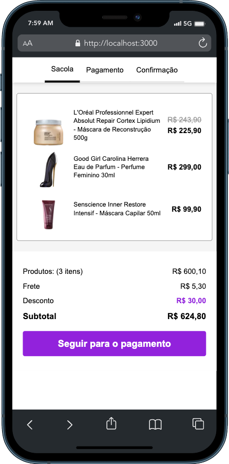
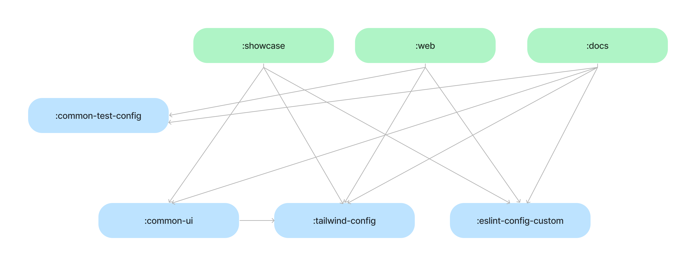

## Teste de Frontend

_Confira as instruções para o Confira as instruções para o [desafio aqui](https://github.com/WillACosta/test-front/tree/main/docs/instructions)._
<br><br>

Aplicação desenvolvida para o teste de frontend, consiste em um fluxo de compras de alguns produtos em uma página web, passando por alguns steps como, carrinho, pagamento e checkout. Aqui você poderá encontrar algumas informações para executar o projeto e também uma demonstração do resultado final.

## Índice

- **[Funcionalidades](#funcionalidades)**
- **[Screenshots](#screenshots)**
- **[Guia da Arquitetura](#guia-da-arquitetura)**
- **[Recursos Técnicos](#recursos-tecnicos)**
- **[Executando](#executando)**

## Funcionalidades

A aplicação consiste em uma representação de um fluxo de compras em um site, utilizando o conceito de mobile first para fornecer
uma melhor experiência de utilização. Temos aqui, basicamente três _features_, `carrinho`, `checkout` e `confirmação`.

## Screenshots



## Guia da Arquitetura

O projeto utiliza conceitos de arquitetura limpa e mono-repo para organização de cada uma das aplicações e bibliotecas
compartilhadas entre as mesmas.



Dentro do diretório `:apps` temos todas as aplicações disponíveis no projeto, e em
`packages` todas as bibliotecas que serão compartilhadas entre si, essa organização pode ser conferida abaixo:

```
  .
  |__apps
  |  |__ showcase
  |  |__ web
  |  |__ ...
  |
  |__packages
  |  |
  |  |__ common-ui
  |  |__ eslint-config-custom
  |  |__ ...
  |
```

## Recursos Técnicos

- CI Workflow com GitHub Actions
- Clean Architecture e conceitos de SOLID
- Abordagem de Modularização utilizando mono-repo
- Gerenciamento do mono-repo com `Turbo Repo`
- Especificação de componentes de Design System
- Radix UI e Tailwind CSS
- Validações de formulários com `Yup` e `React Hook Form`
- Testes unitários do domínio da aplicação

## Executando

Certifique-se de ter no Node instalado em sua máquina.

1. Clone este repositório
```shell
git clone https://github.com/WillACosta/test-front/tree/main
```

2. Instale as dependências
```shell
yarn install
```

3. Execute o comando, para subir as aplicações em ambiente de desenvolvimento
```shell
yarn dev
```

4. Caso deseje rodar os testes unitários, use o comando abaixo
```shell
yarn test
```

Mais detalhes, ver arquivo `package.json` na raiz do projeto.